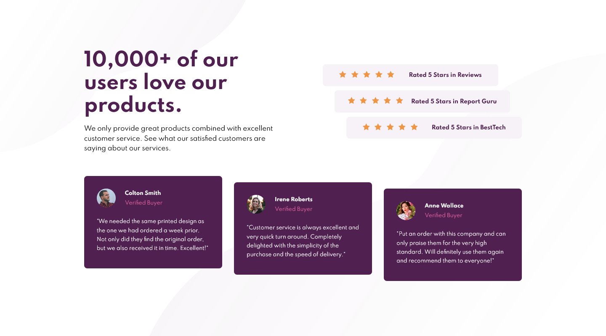

# Frontend Mentor - Social proof section solution

This is a solution to the [Social proof section challenge on Frontend Mentor](https://www.frontendmentor.io/challenges/social-proof-section-6e0qTv_bA). Frontend Mentor challenges help you improve your coding skills by building realistic projects.

## Table of contents

- [Overview](#overview)
  - [The challenge](#the-challenge)
  - [Screenshot](#screenshot)
  - [Links](#links)
- [My process](#my-process)
  - [Built with](#built-with)
  - [What I learned](#what-i-learned)
  - [Continued development](#continued-development)
  - [Useful resources](#useful-resources)
- [Author](#author)

## Overview

### The challenge

Users should be able to:

- View the optimal layout for the section depending on their device's screen size

### Screenshot

### Links

- Solution URL: [https://www.frontendmentor.io/solutions/social-proof-section-html-css-flexbox-grid-eRU1ktFXt](https://www.frontendmentor.io/solutions/social-proof-section-html-css-flexbox-grid-eRU1ktFXt)
- Live Site URL: [https://lumensum.github.io/FEM-social-proof-section/](https://lumensum.github.io/FEM-social-proof-section/)

## My process

### Built with

- HTML
- CSS
- Flexbox
- CSS Grid

### What I learned

I had a hard time with the layout of this challenge.
I used CSS Grid for the first time.

### Continued development

I will try to learn more about CSS Grid. Also I want to try a Mobile First approach next time.

### Useful resources

- [Autoprefixer CSS online](https://autoprefixer.github.io/) - Autoprefixer is a PostCSS plugin which parses your CSS and adds vendor prefixes
- [Pixem](https://matthewkosloski.me/labs/pixem/editor/) - Pixem provides developers with the means to convert pixel units to the equivalient value in ems or rems.

## Author

- Frontend Mentor - [@royschrauwen](https://www.frontendmentor.io/profile/royschrauwen)
- Twitter - [@royschrauwen](https://www.twitter.com/royschrauwen)
